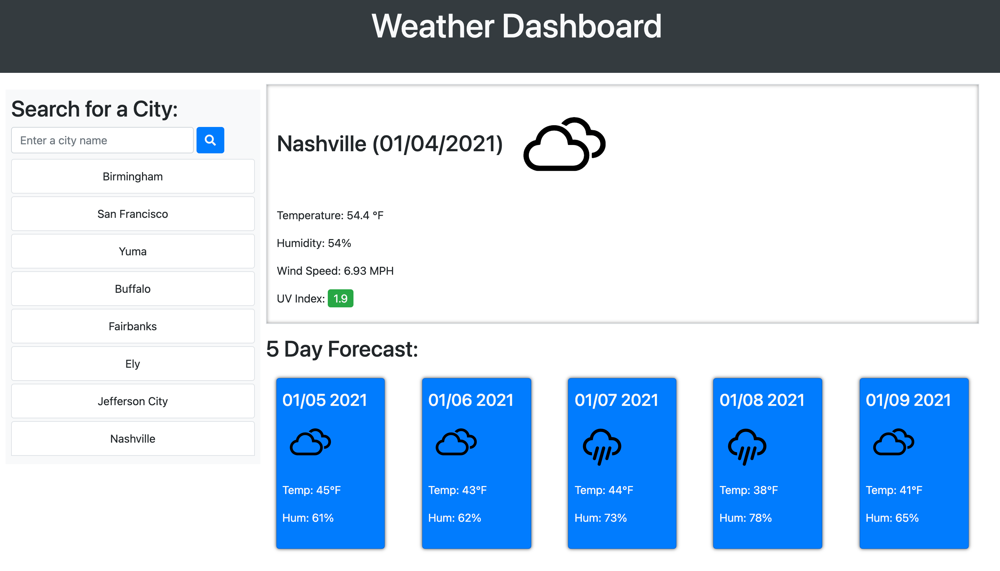

# Weather-Dashboard

## Purpose

A basic weather app to get current weather and five day forecast for over 200,000 cities.

### Table of Contents

- [Website](#website)
- [Built With](#built-with)
- [Resources](#resources)
- [Contribution](#contribution)
  - [Author Contact Info](#author-contact-info)
- [Features](#features)

---

## Website

https://spody10.github.io/weather-dashboard/

[Back to Contents](#table-of-contents)

---

## Built With

- HTML
- CSS
- Javascript

[Back to Contents](#table-of-contents)

---

## Resources

- [OpenWeather](https://openweathermap.org/)

[Back to Contents](#table-of-contents)

---

## Features

- Search weather by city.
- Displays current weather and a five day forecast.
- Up to eight of the most recent search entries are saved.

---

## Contribution

**Michael Spore**

### Author Contact Info:

GitHub: https://github.com/Spody10

[Back to Contents](#table-of-contents)
